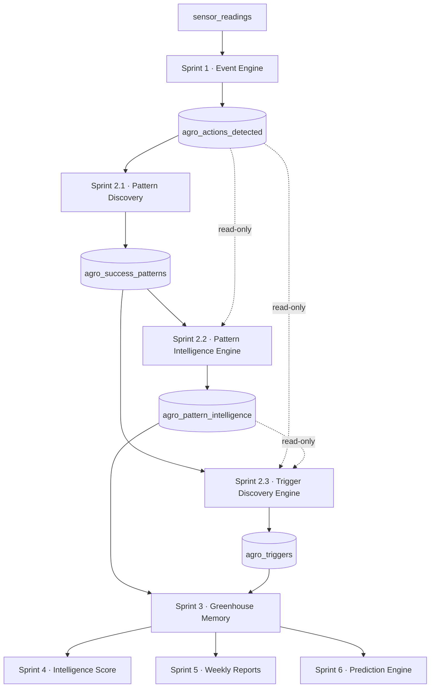

# Rayat Intelligence — Sprint 2.2 + 2.3
## Pattern Intelligence Engine + Trigger Discovery Engine
### Enterprise Architecture — *design only* (no code · no SQL · no migrations)

**Date:** 19 Jun 2026
**Status:** Architecture & system design, implementation-ready. Nothing in this document is executed, committed, or deployed.
**Allowed inputs:** `agro_actions_detected` (Sprint 1) and `agro_success_patterns` (Sprint 2.1) — read-only.
**Forbidden:** external AI services, external datasets, weather APIs, farmer manual input, third-party agronomic models, invented thresholds.

---

## 0. Design contract (non-negotiable invariants)

Every mechanism below obeys five invariants inherited from Sprint 1–2.1 and re-stated as acceptance criteria:

- **Deterministic** — identical inputs ⇒ identical outputs, bit-for-bit. No randomness, no time-of-run dependence beyond explicit `computed_at`.
- **Explainable** — every score and every trigger stores the full factor breakdown that produced it. A human can re-derive the number by hand.
- **Reproducible** — recomputation from the same event corpus yields the same rows (idempotent upsert on deterministic keys).
- **Auditable / traceable** — every derived fact links back to the concrete `agro_actions_detected` rows that justify it (supporting event IDs).
- **Isolated & additive** — read-only over existing intelligence; writes only to *new* derived tables; no changes to Sprint 1, to Pattern Discovery (2.1), to ingestion, to `alarm_events`, to public APIs, or to authentication.

> Principle: **2.1 discovers sequences; 2.2 and 2.3 turn sequences into knowledge.** No black box.

---

## 1. Architectural position



Both new engines are **pure read-only consumers** of existing intelligence and **producers** of two new derived tables. They never mutate their inputs. They run *after* Pattern Discovery in the same nightly/periodic chain.

**Two new derived stores (conceptual — specified in §6):**
- `agro_pattern_intelligence` — ranked, scored, categorised patterns with explainability (Sprint 2.2).
- `agro_triggers` — discovered stress/recovery triggers with lead-time statistics and evidence (Sprint 2.3).

---

## 2. Sprint 2.2 — Pattern Intelligence Engine

### 2.1 Objective
Not every discovered sequence matters. The engine **ranks** every pattern (per scope) and elects category leaders, so downstream sprints consume *a handful of meaningful patterns* instead of hundreds of raw sequences.

### 2.2 Inputs
- `agro_success_patterns`: `event_sequence`, `pattern_type`, `occurrences`, `confidence`, `average_duration_seconds`, `duration_stddev_seconds`, `first_seen`, `last_seen`, `scope_type`, `greenhouse_scope`.
- `agro_actions_detected` (read-only): to compute **success rate** (conditional outcome) and **repeatability** (independence of occurrences) — see below.

### 2.3 Importance Score model (0–100, transparent, weighted)

Five normalised inputs in `[0,1]`, combined by a fixed weighted sum. All weights and reference constants are configuration parameters (env), never hard-coded magic.

| Factor | Symbol | Normalisation | Rationale |
|---|---|---|---|
| Volume | `V` | `ln(1+occurrences) / ln(1+OCC_REF)`, capped at 1 (`OCC_REF≈40`) | rewards frequency with diminishing returns; one-offs stay tiny |
| Confidence | `C` | taken directly from 2.1 (already `0–1`) | statistical reliability of the sequence |
| Recency | `R` | `clamp(1 − days_since(last_seen)/RECENCY_REF)` (`RECENCY_REF≈90`) | stale patterns decay |
| Repeatability | `P` | `min(distinct_independent_occasions / REPEAT_REF, 1)` | 42 hits across 6 sensors & 8 months ≫ 42 hits in one burst |
| Duration consistency | `D` | `clamp(1 − duration_CV)` where `CV = stddev/avg` | stable timing ⇒ trustworthy pattern |

```
importance_score = round( 100 × ( wV·V + wC·C + wR·R + wP·P + wD·D ) )
default weights: wV=0.25, wC=0.30, wR=0.15, wP=0.20, wD=0.10   (Σ = 1.0)
```

**Worked examples (reproducing the spec ordering):**

| Pattern | occ | conf | V | importance (model) | spec |
|---|---|---|---|---|---|
| improvement → stabilization → recovery | 42 | 0.94 | 1.00 | ≈ 96 | 97 |
| out_of_range → worsening | 55 | 0.92 | 1.00 | ≈ 95 | 95 |
| out_of_range → improvement → recovery | 17 | 0.88 | 0.78 | ≈ 86 | 82 |
| anomaly → sensor_drift | 18 | 0.71 | 0.79 | ≈ 65* | 63 |

\* sensor patterns typically score lower `R`/`P` (sparser, less repeated), which the model captures naturally. The model preserves the spec's **ordering** (97 > 95 > 82 > 63); exact magnitudes are tunable via weights. Every score row stores the five normalised factors and the weights used — fully re-derivable.

### 2.4 Success rate (predictive reliability — distinct from confidence)
For a pattern with a given prefix, `success_rate = P(prefix reaches a SUCCESS terminal | prefix occurred and reached a terminal)`, computed as a conditional frequency over `agro_actions_detected`:

```
success_rate = terminations_in_{stabilization,recovery} / (terminations_in_success + terminations_in_failure)
```

This is association-rule **confidence** (outcome reliability), reported alongside the statistical confidence from 2.1. `failure_rate` is its complement for failure analysis. Both are evidence-derived, never assumed.

### 2.5 Pattern categories (per scope)
Selection is deterministic ordering, not a model:

- **Top Success Pattern** — highest `importance_score` among `pattern_type = success`.
- **Top Failure Pattern** — highest `importance_score` among `pattern_type = failure`.
- **Top Sensor Pattern** — highest `importance_score` among `pattern_type = sensor`.
- **Emerging Pattern** — pattern whose **recent rate exceeds its historical baseline rate**:

```
growth_ratio = rate_recent / rate_baseline
rate_recent   = occurrences_in_last(W_recent) / W_recent          (e.g. W_recent = 14 days)
rate_baseline = occurrences_before(W_recent) / baseline_days
EMERGING  ⇔  growth_ratio ≥ GROWTH_MIN (e.g. 1.5)  AND  recent_occurrences ≥ MIN_EMERGING
trend_direction ∈ { rising, stable, declining }  from growth_ratio bands
```

Category leaders are computed **independently for Greenhouse scope and Fleet scope**.

### 2.6 Explainability layer (stored on every row)
`why_important` (deterministic sentence built from the dominant factors), `ranking_factors` (the V/C/R/P/D values + weights), `confidence_factors` (carried from 2.1), `trend_direction`, `growth_ratio`, `success_rate`, `rank_in_category`. No hidden calculation.

---

## 3. Sprint 2.3 — Trigger Discovery Engine

### 3.1 Objective
Learn **what usually happens before** an outcome, in both directions:
- **Stress triggers** — antecedents of `out_of_range`, `worsening`, `anomaly`.
- **Recovery triggers** — antecedents of `recovery`, `stabilization`, `return_to_range`, `improvement`.

### 3.2 Method — temporal precedence mining (within allowed inputs only)
For each **consequent** event instance in a greenhouse, look back over a bounded **lead-time horizon** `H` and collect candidate **antecedents**:

- **Event antecedents** — another event type that preceded the consequent (e.g. `anomaly → sensor_drift`, `stabilization → recovery`). Straight from event precedence on the same or related sensor in the same greenhouse.
- **Condition antecedents (cross-metric)** — an event on a *different* metric in the same greenhouse whose **observed `value_snapshot`** characterises the condition (e.g. a humidity event with `value_snapshot ≈ 55–57` preceding an EC `out_of_range`).

Aggregating identical (antecedent → consequent) candidates across many consequent instances yields a trigger with occurrences, lead-time statistics, an empirical threshold, a false-positive rate, and confidence.

### 3.3 Thresholds are **discovered, never invented**
The number "57%" is **not** a rule. It is the empirical boundary of the antecedent's `value_snapshot` distribution observed *in the lead-up to the consequent*, taken from values already stored in `agro_actions_detected` (`value_snapshot`, `range_snapshot`, and stats inside `evidence_json`):

```
threshold = robust_percentile( value_snapshots_of_antecedent_events_that_preceded_consequent )
            (e.g. P50 or the boundary where the consequent reliably follows)
stored with: observed_min, observed_max, sample_count, threshold_basis = "empirical Pxx"
```

If `value_snapshot` evidence is insufficient, the trigger degrades gracefully to a **qualitative** antecedent (`metric + direction`, e.g. "humidity low / decreasing") with **no numeric threshold** — still 100% data-derived, never fabricated.

### 3.4 Lead-time discovery
For each supporting instance, `lead_time = started_at(consequent) − reference_time(antecedent)` (reference = antecedent `ended_at` if present, else `started_at`). The trigger stores **average, minimum, maximum, variance** of lead time. Real systems show 2 h → 7 d ranges; the engine reports whatever the data shows, with units.

### 3.5 Trigger confidence model (0–1)
```
confidence = occGate × ( wR·recency + wRep·repeatability + wL·lead_consistency ) × (1 − FPR)
  occGate          = min(occurrences / OCC_REF_T, 1)         (rare ⇒ low; single occurrence ⇒ rejected, see §5)
  recency          = clamp(1 − days_since(last)/RECENCY_REF_T)
  repeatability    = min(distinct_greenhouses_or_episodes / REPEAT_REF_T, 1)
  lead_consistency = clamp(1 − leadtime_CV)
  FPR (false positive rate) = antecedent_without_consequent / total_antecedent_occurrences
```

The `(1 − FPR)` multiplier is the precision guard: an antecedent that *frequently* occurs **without** the consequent is unreliable and is pushed toward zero confidence regardless of how often it co-occurs. Rare triggers stay low (occGate); frequent, consistent, low-false-positive triggers gain confidence.

### 3.6 Trigger categories
- **Stress triggers:** humidity · EC · pH · temperature · NPK · sensor.
- **Recovery triggers:** improvement · stabilization · return_to_range · recovery.

Category is derived from the antecedent's metric/event class — deterministic.

### 3.7 Scope
Every trigger exists at two levels, computed independently:
- **Greenhouse trigger** — specific to one device (e.g. "humidity ≈ 57% → stress, greenhouse #127").
- **Fleet trigger** — corroborated across many greenhouses (e.g. "humidity < 55% → stress, fleet-wide"). Fleet triggers additionally require a **minimum number of distinct greenhouses** to qualify, preventing a single site from defining a fleet rule.

### 3.8 Explainability layer (stored on every trigger)
`supporting_examples` (concrete antecedent/consequent event-ID pairs + their lead times), `example_sequences`, lead-time statistics, `confidence_factors` (occGate, recency, repeatability, lead_consistency, FPR), `scope`, `evidence` (value distribution, counts). Every trigger is traceable to real events.

---

## 4. Worked examples mapped to the model

| Discovery | Antecedent | Consequent | occ | lead (avg) | FPR | confidence |
|---|---|---|---|---|---|---|
| Stress | humidity ≤ ~57% (empirical) | EC `out_of_range` | 28 | 3 d | low | ≈ 0.92 |
| Stress | temperature ≥ ~31°C (empirical) | `worsening` | 21 | 2.4 d | low | ≈ 0.88 |
| Recovery | EC decreasing → `improvement` | `recovery` | 17 | 2 d | low | ≈ 0.88 |
| Recovery | `stabilization` | `recovery` | 34 | 18 h | very low | ≈ 0.95 |

Each row is reconstructable from precedence + lead-time deltas + value distributions already present in `agro_actions_detected`.

---

## 5. Quality rules (enforced by design)

| Rule | Enforcement |
|---|---|
| Never a trigger from a single occurrence | `occurrences ≥ MIN_TRIGGER_OCC` (≥ 2, recommended ≥ 5); `occGate` keeps few-shot low |
| Never a pattern from insufficient evidence | inherits 2.1 `MIN_OCCURRENCES`; intelligence only ranks already-qualified patterns |
| Never invent thresholds | thresholds are empirical percentiles of stored `value_snapshot`; otherwise qualitative |
| Never infer missing data | instances overlapping a Data Gap / offline window are **excluded**, not imputed (Quality-Gate concept reused conceptually) |
| Suppress low-confidence discoveries | rows below `MIN_CONFIDENCE` are not surfaced (optionally stored as `suppressed=true` for audit, never consumed) |
| Everything traceable | `supporting_examples` / `ranking_factors` link every number to source events |

---

## 6. Data structures (conceptual field specifications — NOT DDL)

> These are design specifications for the implementation sprint, expressed conceptually. No SQL is produced here.

### 6.1 `agro_pattern_intelligence` (Sprint 2.2 output)
| Field | Conceptual type | Meaning / source |
|---|---|---|
| `intelligence_id` | text, unique key | deterministic: `scope:greenhouse:pattern_id` |
| `pattern_ref` | text | references `agro_success_patterns.pattern_id` |
| `scope_type` / `greenhouse_scope` / `fleet_scope` | enum / int / bool | fleet vs greenhouse |
| `pattern_type` | enum | success · failure · sensor · other |
| `event_sequence` | text | carried from 2.1 |
| `occurrences` / `confidence` | int / numeric(0–1) | carried from 2.1 |
| `success_rate` / `failure_rate` | numeric(0–1) | conditional outcome (§2.4) |
| `importance_score` | int (0–100) | §2.3 |
| `ranking_factors` | json | V, C, R, P, D + weights (explainability) |
| `trend_direction` / `growth_ratio` | enum / numeric | §2.5 |
| `is_top_success` / `is_top_failure` / `is_top_sensor` / `is_emerging` | bool | category election per scope |
| `rank_in_category` | int | position within scope+type |
| `why_important` | text | deterministic explanation sentence |
| `first_seen` / `last_seen` / `computed_at` | timestamptz | provenance |
| `rule_version` | text | e.g. `s2.2` |

### 6.2 `agro_triggers` (Sprint 2.3 output)
| Field | Conceptual type | Meaning / source |
|---|---|---|
| `trigger_id` | text, unique key | deterministic: `scope:greenhouse:type:antecedent→consequent` |
| `trigger_type` | enum | stress · recovery |
| `trigger_class` | enum | humidity · EC · pH · temperature · NPK · sensor · improvement · stabilization · return_to_range · recovery |
| `metric` | text | antecedent metric |
| `condition` | enum | below · above · decreasing · increasing · event_present |
| `threshold` / `threshold_basis` | numeric \| null / text | empirical Pxx of `value_snapshot`, or null (qualitative) |
| `consequent_event` | text | out_of_range · worsening · anomaly · recovery · stabilization · return_to_range · improvement |
| `lead_time_avg/min/max/variance` | interval/numeric | §3.4 |
| `occurrences` / `false_positive_rate` | int / numeric(0–1) | §3.5 |
| `confidence` | numeric(0–1) | §3.5 |
| `scope_type` / `greenhouse_scope` / `fleet_scope` | enum / int / bool | §3.7 |
| `supporting_examples` | json | antecedent/consequent event-ID pairs + lead times (traceability) |
| `confidence_factors` / `evidence` | json | full breakdown + value distribution |
| `first_seen` / `last_seen` / `computed_at` / `rule_version` | timestamptz / text | provenance |

Both tables are **derived and disposable**: they can be fully rebuilt from `agro_actions_detected` + `agro_success_patterns` at any time.

---

## 7. Determinism, idempotency, scheduling

- **Idempotent upsert** on the deterministic keys (`intelligence_id`, `trigger_id`); repeated runs update in place — zero duplicates.
- **Deterministic recompute** over a bounded window; same corpus ⇒ same scores/triggers. Safe to run hourly and safe to re-run historically.
- **Scheduler:** reuse `node-cron`, additive, behind the existing feature flag (default OFF). Recommended chained order in a single periodic orchestration: Pattern Discovery (2.1) → Pattern Intelligence (2.2) → Trigger Discovery (2.3). Suggested cadence: intelligence hourly/daily; trigger discovery daily (it scans longer lead-time horizons). No contention with the Sprint 1 15-minute event cycle (separate jobs).
- **Performance:** both engines operate on the already-condensed event/pattern corpus (orders of magnitude smaller than `sensor_readings`); bounded by lookback window; expected sub-second to low-seconds per run at fleet scale (consistent with the 2.1 benchmark of ~3k events in ~120 ms). Supporting read indexes are **additive** (e.g. on `(greenhouse, consequent, started_at)` access paths), never altering existing ones.

---

## 8. Isolation & safety

- Read-only over `agro_actions_detected` and `agro_success_patterns`. **No writes** to either, to `alarm_events`, to `active_alerts`, or to ingestion.
- **No changes** to any Sprint 1 module or to Pattern Discovery (2.1). New engines live in new files + two new derived tables + additive indexes + additive jobs only.
- **No external services / datasets / weather / third-party models / manual input.** All knowledge is endogenous.
- Feature-flagged OFF by default ⇒ zero runtime impact until explicitly enabled.

---

## 9. Consumption contracts for downstream sprints

- **Sprint 3 — Greenhouse Memory:** reads, per greenhouse, the elected Top Success/Failure/Sensor/Emerging patterns and the high-confidence stress/recovery triggers, to assemble the greenhouse's behavioural fingerprint.
- **Sprint 4 — Intelligence Score:** aggregates `importance_score` of failure vs success leaders and trigger reliability into a single health/maturity score.
- **Sprint 5 — Weekly Reports:** narrates "what worked / what failed / what's emerging / which triggers are active" using the stored `why_important` and trigger `evidence` (LLM narrates pre-computed facts only).
- **Sprint 6 — Prediction Engine:** uses triggers + lead-time statistics for early-warning ("humidity trend matches a 3-day stress trigger, confidence 0.92").

---

## 10. Future dashboard consumption (UI/UX — not built in this sprint)

Not visible yet. When surfaced, the natural presentation is: four "knowledge cards" per greenhouse (Top Success · Top Failure · Top Sensor · Emerging) each with a one-line `why_important` and a drill-down to occurrences/factors; and a **trigger watchlist** showing antecedent → consequent, average lead time as a countdown, confidence, and a "show evidence" link to the supporting events. Every surface exposes the explainability payload — the UI shows knowledge, never a black box.

---

## 11. Verification strategy (for the implementation sprint)

1. `node --check` on new modules.
2. **In-memory** unit tests of the pure functions: importance scoring (reproduce the §2.3 ordering and the §4 trigger examples), success-rate, emerging detection, trigger lead-time stats, FPR, confidence.
3. **Real PostgreSQL** (embedded-postgres) end-to-end: seed synthetic event histories that contain known patterns/triggers; assert importance ranking, category election, trigger discovery, empirical thresholds, and lead times.
4. **Idempotency / determinism:** double run ⇒ identical rows, zero duplicates, identical scores.
5. **Isolation:** assert `alarm_events` and `active_alerts` row counts unchanged; assert no writes to `agro_actions_detected` / `agro_success_patterns`.
6. **Performance:** benchmark on a bulk synthetic corpus.

---

## 12. Rollback strategy

Drop the two derived tables (`agro_pattern_intelligence`, `agro_triggers`) and any additive indexes; remove the new job files and their additive wiring. Because the engines are read-only and feature-flagged OFF, rollback is instantaneous and lossless — the source intelligence (`agro_actions_detected`, `agro_success_patterns`) is untouched and the derived tables are fully rebuildable.

---

## 13. Risks & open questions (for review before implementation)

- **Threshold semantics:** empirical percentile vs decision-boundary search — start with robust percentile (P50/P90) of `value_snapshot`; revisit if precision/recall on triggers is weak.
- **Cross-metric attribution:** humidity→EC requires same-greenhouse temporal association across sensors; define the lead-time horizon `H` per trigger_class (configurable) to avoid spurious links.
- **Window vs cumulative occurrences:** like 2.1, decide whether occurrences are window-bounded (slides) or cumulative-historical; recommendation: window-bounded with `first_seen` preserved, matching 2.1.
- **Emerging vs noise:** `GROWTH_MIN` and `MIN_EMERGING` must be tuned to avoid flagging statistical noise as emerging.
- **Pruning:** derived tables should have a retire/prune policy for patterns/triggers that fall below evidence thresholds over time (candidate for Sprint 3 housekeeping).

---

## 14. Deliverables checklist

**Sprint 2.2 — Pattern Intelligence Engine:** importance ranking model (0–100) · Top Success / Top Failure / Top Sensor / Emerging election · success-rate · fleet + greenhouse scope · explainability layer (`why_important`, ranking factors). ✅ designed.

**Sprint 2.3 — Trigger Discovery Engine:** stress trigger discovery · recovery trigger discovery · empirical (non-invented) thresholds · lead-time discovery (avg/min/max/variance) · confidence model with false-positive guard · fleet + greenhouse scope · explainability/evidence layer. ✅ designed.

**Outcome:** Rayat moves from *Event Intelligence + Pattern Discovery* to **Behavioural Intelligence** — it knows what works, what fails, what precedes stress, what precedes recovery, which patterns matter, and which triggers are reliable — forming the knowledge foundation for the Greenhouse Memory Engine (Sprint 3).
